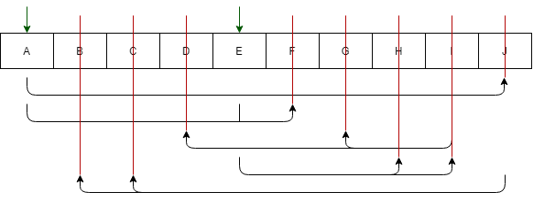

CA_P_EmailΆσκηση 2η

Έστω η καθολική σχέση R = {A,B,C,D,E,F,G,H,I,J}  και το σύνολο συναρτησιακών εξαρτήσεων { {A}->{J}, {E,A}->{F}, {I}->{G,D}, {E}->{I,Η}, {J}->{C,B} }.

Ελέγχοντας μία προς μία τις εξαρτήσεις έχουμε το εξής αποτέλεσμα:

α) Προφανές υπερκλειδί για την R είναι το  {A,B,C,D,E,F,G,H,I,J}.

- Τα Α,Ε δεν μπορούν να αφαιρεθούν καθώς είναι μη εξαρτημένα.
- Το J μπορεί να αφαιρεθεί καθώς {A}->{J}
- Το F μπορεί να αφαιρεθεί καθώς {E,A}->{F}
- Τα G,D μπορούν να αφαιρεθούν καθώς {I}->{G,D}
- Τα I,Η μπορούν να αφαιρεθούν καθώς {E}->{I,Η}
- Τα  C,B μπορούν να αφαιρεθούν καθώς  {J}->{C,B} 

Η κλειστότητα $(A,E)^+$ με βάση την F είναι {A,B,C,D,E,F,G,H,I,J} και επομένως το {Α,Β} είναι ένα υποψήφιο κλειδί για την R.

β) Η κανονικοποίηση σε 2NF είναι:

R1(<u>A</u>, J, C, B)

R2(<u>E</u>, <u>A</u>, F)

R3(<u>E</u>, I, H, G, D)

γ) Η κανονικοποίηση σε 3NF είναι:\

R1(<u>A</u>, J)

R2(<u>E</u>, <u>A</u>, F)

R3(<u>E</u>, I, H)

R4(<u>J</u>, C, B)  ->Το J είναι υπογραμμισμένο

R5(<u>I</u>, G, D)

----

----

Άσκηση3

a)Για τον πίνακα CAMPER έχουμε:

Προφανές υπερκλειδί είναι το R{CA_SSN, CA_Name, CA_Surname, CA_Age, CA_Pnum, CA_Gender, CA_KoI, CA_YoR, CA_D_Name, CA_D_Pnum, CA_P_Name, CA_P_Surname, CA_P_Email, CA_P_Pnum, CT_Name,FA_Name}

H κλειστότητα $(CA \_ SSN)^+$ με βάση την F είναι  {CA_SSN, CA_Name, CA_Surname, CA_Age, CA_Pnum, CA_Gender, CA_KoI, CA_YoR, CA_D_Name, CA_D_Pnum, CA_P_Name, CA_P_Surname, CA_P_Email, CA_P_Pnum, CT_Name,FA_Name} , επομένως το {CA_SSN} είναι ένα υποψήφιο κλειδί για την R.

H κλειστότητα $(CA \_ SSN)^+$ με βάση την F είναι  {CA_SSN, CA_Name, CA_Surname, CA_Age, CA_Pnum, CA_Gender, CA_KoI, CA_YoR, CA_D_Name, CA_D_Pnum, CA_P_Name, CA_P_Surname, CA_P_Email, CA_P_Pnum, CT_Name,FA_Name} , επομένως το {CA_SSN} είναι ένα υποψήφιο κλειδί για την R.

Από τις συναρτησιακές εξαρτήσεις προκύπτει ότι το γνώρισμα CA_SSN αποτελεί υποψήφιο κλειδί και μπορεί να επιλεχθεί ως πρωτεύον κλειδί. Παρατηρούμε ότι το κλειδί που διαλέξαμε είναι ίδιο με αυτό που προκύπτει από τις συναρτησιακές εξαρτήσεις.

b) Ο πίνακας CAMPER είναι σε κανονική μορφή 1NF καθώς υπάρχουν μόνο ατομικές τιμές για τα γνωρίσματα. Ακόμη, το πρωτεύον αποτελείται από ένα γνώρισμα μόνο και συνεπώς δεν χρειάζεται να γίνει έλεγχος(υπάρχει πλήρη συναρτησιακή εξάρτηση). Άρα, ο πίνακας είναι ήδη κανονικοποιημένος σε 2NF.

c) Ο πίνακας είναι σε 2NF. Ακόμη, δεν υπάρχουν μεταβατικές εξαρτήσεις, άρα είναι ήδη και σε 3NF.

Για τον πίνακα CAMP_EMPLOYEE έχουμε:

a)Προφανές υπερκλειδί είναι το R{CE_SSN, CE_Name, CE_Surname, CE_Age, CE_Gender, CE_RoleI, MedicalInsured, Profession, YearsOfService, IsVolunteer, FA_Name}.

Η κλειστότητα $(CE\_ SSN)^+$ με βάση την F είναι {CE_SSN, CE_Name, CE_Surname, CE_Age, CE_Gender, CE_RoleI, MedicalInsured, Profession, YearsOfService, IsVolunteer, FA_Name}, επομένως το {CE_SSN} είναι ένα υποψήφιο κλειδί για την R.

Η κλειστότητα $(CE\_ SSN)^+$ με βάση την F είναι {CE_SSN, CE_Name, CE_Surname, CE_Age, CE_Gender, CE_RoleI, MedicalInsured, Profession, YearsOfService, IsVolunteer, FA_Name}, επομένως το {CE_SSN} είναι ένα υποψήφιο κλειδί για την R.

Από τις συναρτησιακές εξαρτήσεις προκύπτει ότι το γνώρισμα CE_SSN αποτελεί υποψήφιο κλειδί και μπορεί να επιλεχθεί ως πρωτεύον κλειδί. Παρατηρούμε ότι το κλειδί που διαλέξαμε είναι ίδιο με αυτό που προκύπτει από τις συναρτησιακές εξαρτήσεις.

b) Ο πίνακας CAMP_EMPLOYEE είναι σε κανονική μορφή 1NF καθώς υπάρχουν μόνο ατομικές τιμές για τα γνωρίσματα. Ακόμη, το πρωτεύον αποτελείται από ένα γνώρισμα μόνο και συνεπώς δεν χρειάζεται να γίνει έλεγχος(υπάρχει πλήρη συναρτησιακή εξάρτηση). Άρα, ο πίνακας είναι ήδη κανονικοποιημένος σε 2NF.

c) Ο πίνακας είναι σε 2NF. Ακόμη, δεν υπάρχουν μεταβατικές εξαρτήσεις, άρα είναι ήδη και σε 3NF.